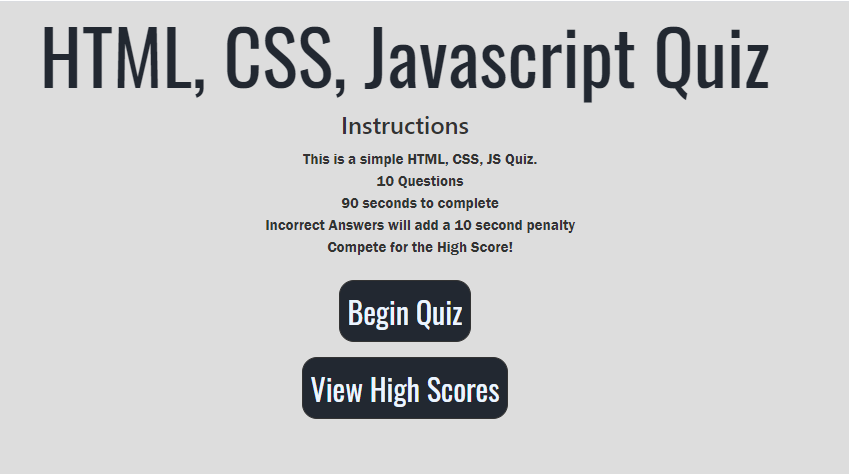
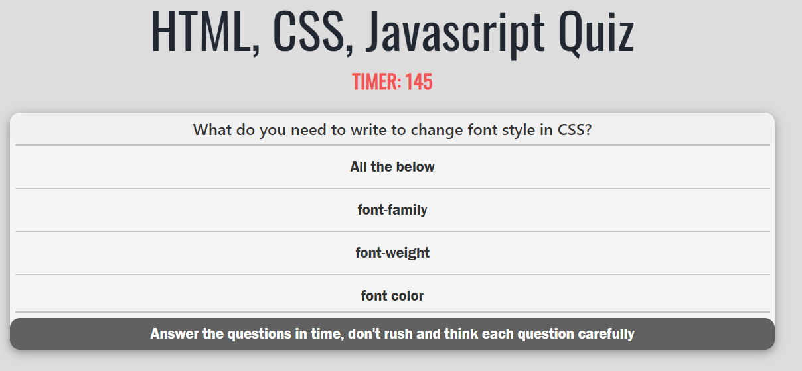
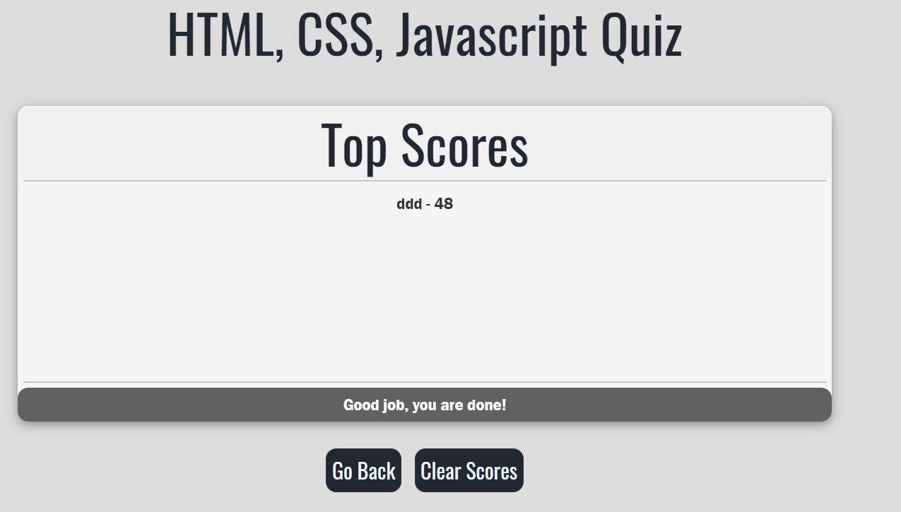

Try the quiz at this link: https://tonyrpark.github.io/04-webApi-codeQuiz-tonyPark/ 

# Files

Main files: 

-------------------
1. index.html
2. style.css
3. script.js
4. questions.js
-------------------

## Quiz Elements

- 10 Questions
- HTML, CSS, JS Topic

### Question Bank w/ multiple choice

- Make an object with and array of questions in it
- Make the questions in a separate "question.js" file

### Starting Page

- Top H1 = "HTML, CSS, Javascript Quiz"
- Instructions:
        - This is a simple HTML, CSS, JS Quiz
        - 10 Questions
        - 90 seconds to complete
        - Incorrect Answers will add a 10 second penalty
        - Compete for the High Score!

### Timer

- Create a time for 90 seconds
- Display time in top of page in the center

### Start Button

- Button will have rounded corners
- Button will be blue and use bootstrap styling

### Score Tracker

- Score will be presented after the game ends
- Up to 10 high scores
- Initials only like old stye arcade games

### MISC

- This quiz will be timed
- A score will be needed
- Will have a start button
- Timer will start once start button is clicked
- Also when start button clicked a question will be presented
- Will have 4 answers to choose from
- if True answer then score goes up
- If false answer then time is subtracted from total time
- Quiz is over when
  a. all answers are done OR
  b. time runs out
- Score is presented on screen

#### Screenshots

